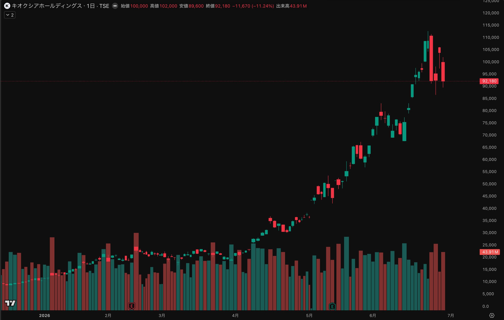

# 出力サンプル：キオクシア（285A）日足チャート分析（デイトレ目線）

これは、ユーザーがキオクシアの**日足チャートのスクリーンショット**を添付し、「このチャートをテスタの手法で分析して。デイトレ目線、資金は1000万円。」と指示した際の出力サンプルです。スキルが実際にどう振る舞うかを示すためのものです。

> ⚠️ これは過去のサンプルであり、投資助言ではありません。数値はサンプル時点（2026-06-26時点）のものです。

---

## ユーザー入力

> （日足チャート画像を添付）
> このチャートをテスタの手法で分析して。デイトレ目線、資金は1000万円。

チャートの最終足（当日）：始値100,000 / 高値102,000 / 安値89,600 / 終値92,180、前日比 -11,670（-11.24%）、出来高43.91M。

---

## スキル出力

判断前に Web 検索で現値・直近の値動き・急落理由を取得し、チャート（実観測）と一致することを確認しています。最重要の発見：**現値¥92,180だと1単元（100株）＝約¥922万**で、資金1000万円の約92%。これがデイトレ可否を決定づけます。

### 【ティッカー / コンテキスト要約】

キオクシアHD（285A・東証プライム）。終値 **92,180円**（前日比 −11,670 / **−11.24%**、始値100,000・高値102,000・安値89,600、出来高43.91M）＝出所：提出チャート＋Web検索（2026-06-26時点で一致）。

直近は異常な高ボラ：6/22に上場来高値 108,700円 →6/23 **−15%** →6/25 **+12.27%**（103,850）→6/26 **−11.24%**（92,180）。日々10〜15%が両方向に振れる相場。チャート上も4月の約35,000円から6月の約112,700円まで短期間で約3倍化した**パラボリック上昇のあとの天井崩れ・乱高下フェーズ**。

材料：生成AI向けNAND/SSD需要で業績は好調（FY売上+37%、営業利益+92.7%）。一方、6/16にバーンスタインが「50%下落余地」レポート、6/24マイクロン決算を控えたメモリ株連動の警戒感が急落の引き金。**板・歩み値はユーザー未提供のため未観測。**

---

### 【推奨タイムフレーム】

デイトレ（同日決済）が前提なら適合はする — 出来高潤沢・ボラ十分で短期フローは効く。ただし**この銘柄を1000万円の資金でデイトレするのは、サイジング上ほぼ不可能**（下記）。テスタの「資金量×流動性で戦い方を変える／勝てる場所だけ参加」に照らすと、**現状は「見送り or 単元未満株で極小ロット」が原則整合的**。

---

### 【ポジションサイズのガイダンス】← 最大の論点

- **1単元コスト = 92,180 × 100株 = 約922万円**。これは資金1000万円の**約92%**。1単元買った瞬間にフルポジ・過剰集中で、テスタの「1トレード損失を資金の0.5〜1%（＝5〜10万円）に収める」原則と**完全に両立しない**。
- **1単元あたりの想定日中変動額** ≒ 直近日の値幅（102,000−89,600＝12,400円）×100株 = **約124万円/日**。1単元を持つだけで資金の**±12%**が1日で動く。許容損失（5〜10万円）の**12〜25倍**。
- 結論：**「資金があるから1単元買える」と「リスク管理上買うべき」は別物**。選択肢は——
  (a) **S株/ミニ株（単元未満株）で5〜10株単位**に分割し、損失を5〜10万円枠に収める、
  (b) より低位の半導体・メモリ関連の代替銘柄に振り替える、
  (c) **見送り**。
  デイトレ前提なら(a)も約定・スプレッドで不利になりやすく、**実質は(b)か(c)が無難**。

---

### 【需給分析】

判定：**売り優勢〜不安定（高ボラ両建て的）**。証拠：
- 実観測（チャート）＝天井崩れの大陰線・安値引け近辺、上ヒゲ残し。パラボリック後の**典型的な分配/反転の値動き**。
- Web検索＝6/23 −15%、6/25 +12%、6/26 −11%の連続。**方向感が1日で反転**しており、トレンドフォローもディップ買いも刈られやすい「往復ビンタ」地合い。
- リアルタイムの売り板消化・成行の連続性は**未観測**。寄り後の歩み値で「売りを食って戻すか／戻り売りに押されるか」を見るまで方向は断定不可。

テスタのネガティブ条件（上昇の即反落・サポートされないディップ・材料出尽くし感）に複数該当。

---

### 【エッジ評価】Low

理由：①サイジングが資金規模と絶望的に不整合（最大の減点）、②盤面未観測、③値動きが両方向ランダムに近く「勝つ理由が負ける理由を明確に上回る」状態にない。テスタなら**「自分が優位に立てない場所」として見送る典型**。

---

### 【エントリートリガー / ゾーン】（仮に単元未満株で極小参加する場合のみ）

無闇に飛びつかない。寄り後の歩み値で**売りを食って前日高値（102,000近辺）を出来高伴いブレイク**する実需を確認できた時だけ、ごく小ロットで。落ちるナイフ（安値89,600更新の下落途中）には手を出さない。

---

### 【ストップロス / 無効化レベル】

直近安値 **89,600円割れ**で機械的撤退、または上昇の即時反落＋出来高減で即手仕舞い。**同日中に必ず全決済**（オーバーナイトでマイクロン決算系・メモリ連動ギャップのリスクを排除）。損切りは資金の0.5〜1%に収まるロットでしか持たない。

---

### 【主要リスク・監視ポイント】

マイクロン等メモリ大手の決算・ガイダンスへの連動、バーンスタイン弱気レポート後の戻り売り、半導体マクロ／為替、薄い瞬間のスリッページ、そして何より**1単元=フルポジによる過剰集中→1回の逆行で資金の10%超を失う規律崩壊リスク**。

---

### 【心理・規律リマインダー】

77倍まで上げた銘柄の天井圏は**FOMOが最も働く場所**。「もう下げた＝安い」は値嵩・高ボラ株では通用しない。疲労・リベンジ・取り返し心理が出たら触らない。参加しない判断もトレード。

---

### 【適応注記】

メモリ／AI半導体は今もっとも参加者が多い混雑テーマ。順張りもディップ買いも手垢がつき、エッジは薄れている。板で都度、自分が優位かを確認すること。

---

### 【免責】

これは公開インタビュー・X投稿・記事等の合成による教育/参考目的であり、投資助言ではありません。株式取引は元本割れを含む大きな損失リスクを伴います。テスタさんの連続黒字実績は将来の成果を保証しません。ご自身の資金力・心理・市場環境で判断してください。

---

### まとめ（ひとこと）

**チャートは魅力的に見えるが、株価9万円台×100株単元で1000万円だと「1単元＝ほぼ全財産」になり、テスタ流のリスク管理が物理的に成立しない。デイトレ対象としては見送り、やるなら単元未満株か低位の代替銘柄、が原則整合的な結論。**
